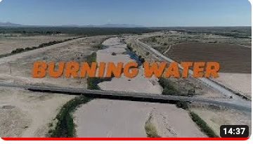

---
# Feel free to add content and custom Front Matter to this file.
# To modify the layout, see https://jekyllrb.com/docs/themes/#overriding-theme-defaults

layout: page
title : media
---

## Media

- A short river-focused documentary film created by Esperanza Chairez, formerly Communications Coordinator for the Nuestra Tierra Conservation Project

 `

- A Story Map, Remembering the Rio: A collection of archives, interviews, and photographs documenting the lower Rio Grande through time. Student Project, 2022, Seminar on Critical Approaches to Place. Published on NMSU Student Story Map Projects webpage

 `

- A short river-focused documentary film created by Annie Ersinghaus, an NMSU alumni and former student at the NMSU Creative Media Institute

 `

